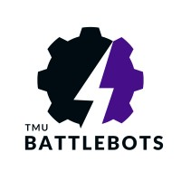

<div align="center">

# 🤖 BattleBots TMU



> *Engineering the future of combat robotics in Canada*

</div>

Welcome to the official GitHub repository for **BattleBots TMU**! We are Toronto Metropolitan University's premier combat robotics team dedicated to designing, building, and competing with battle robots across North America.

<div align="center">

## 🔥 Our Mission

</div>

BattleBots TMU exists to:
- Foster engineering excellence through hands-on robotics experience
- Build a thriving combat robotics community in Canada
- Provide students with real-world design and fabrication skills
- Compete at the highest levels of combat robotics competitions

<div align="center">

## 🚀 Our Approach

</div>

We believe in learning by doing. New members start building immediately:

- **1lb (Antweight) & 3lb (Beetleweight)** robots for newcomers to gain immediate hands-on experience
- **30lb (Featherweight)** robots for our experienced team members
- Future plans include expanding to **250lb robots** for major international competitions

This tiered approach ensures everyone can contribute meaningfully while developing their skills progressively.

<div align="center">

## 🛠️ Technologies & Skills

</div>

Our team works with cutting-edge technologies across multiple disciplines:

- **Mechanical Design:** SolidWorks, Fusion 360, FEA simulation
- **Materials:** Titanium, hardened steel, carbon fiber composites
- **Manufacturing:** CNC machining, 3D printing, waterjet cutting
- **Electronics:** Custom PCB design, brushless motor control, power management
- **Software:** Robot control systems, telemetry, autonomous features

<div align="center">

## 🏆 Competitions

</div>

We actively participate in competitions including:

- **BotBrawl**
- And we're working to establish more competitions within Canada!

<div align="center">

## 📂 Repository Structure

</div>

```
BattleBots-TMU/
├── Designs/
│   ├── Antweight-1lb/
│   ├── Beetleweight-3lb/
│   └── Featherweight-30lb/
├── Electronics/
│   ├── Control-Systems/
│   ├── Power-Distribution/
│   └── Weapon-Systems/
├── Software/
│   ├── Control-Firmware/
│   ├── Telemetry/
│   └── Testing-Tools/
└── Documentation/
    ├── Build-Guides/
    ├── Competition-Resources/
    └── Training-Materials/
```

<div align="center">

## 🌟 Join Our Team

</div>

We welcome students of all skill levels and backgrounds:
- **No prior experience required** — just enthusiasm and willingness to learn
- Mentorship program pairs new members with experienced builders
- Regular workshops cover essential skills and technologies
- Build your own combat robot from day one!

<div align="center">

## 🔗 Connect With Us

[](https://www.instagram.com/tmubattlebots/)
[](https://www.linkedin.com/company/tmu-battlebots/posts/?feedView=all)
[](https://tmu-battlebots.github.io/TMU-Battlebots/)

**Email:** battlebots@mues.ca

</div>

<div align="center">

## 🤝 Supporting Organizations

</div>

We thank our sponsors and partners who make our work possible:
- Toronto Metropolitan University

<div align="center">

## 🚀 Future Goals

</div>

- Host Canada's largest combat robotics tournament
- Establish TMU as a hub for combat robotics innovation
- Develop pioneering technologies that advance the sport
- Create a comprehensive educational curriculum for combat robotics

<div align="center">

## 📝 Contributing

</div>

Interested in contributing to our codebase or designs? Check out our [CONTRIBUTING.md](CONTRIBUTING.md) guide to get started.

<div align="center">

---

*Building Champions, Fostering Innovation, Growing Community*


</div>
